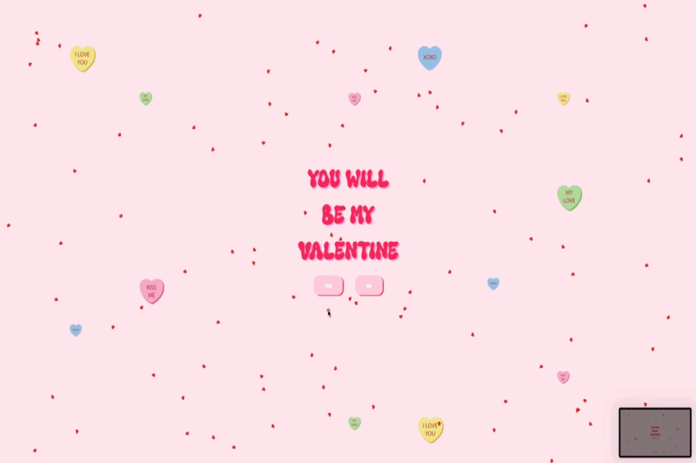

## How to Access the Application

**Visit the Application:** Access the web application by navigating to [https://master--superlative-cuchufli-eb7a5e.netlify.app/](https://master--superlative-cuchufli-eb7a5e.netlify.app/). This link will direct you to the main interface where you can start exploring its features.

### ⚠️Important Compatibility Notice⚠️

**Browser Compatibility:** Please note that the application leverages the Scroll API, which might not be supported by all web browsers. For the best experience, I highly recommend using **Google Chrome** as your browser of choice. Users of Safari and other browsers might encounter limitations due to compatibility issues with the Scroll API.

Compability information at https://caniuse.com/?search=animation-timeline%3A%20scroll()

**Screen Size Consideration:** The application is optimized for desktop use and requires a fullscreen window for optimal functionality. We advise against using it on smaller screens or mobile devices to ensure you get the full experience without any compromises.

By adhering to these recommendations, you can enjoy the full capabilities and features of our application without any hindrances. Thank you for your understanding and cooperation.

## DEMONSTRATION

**🎉Confetti 🎉**

**💕Cluster Bombs💕**

